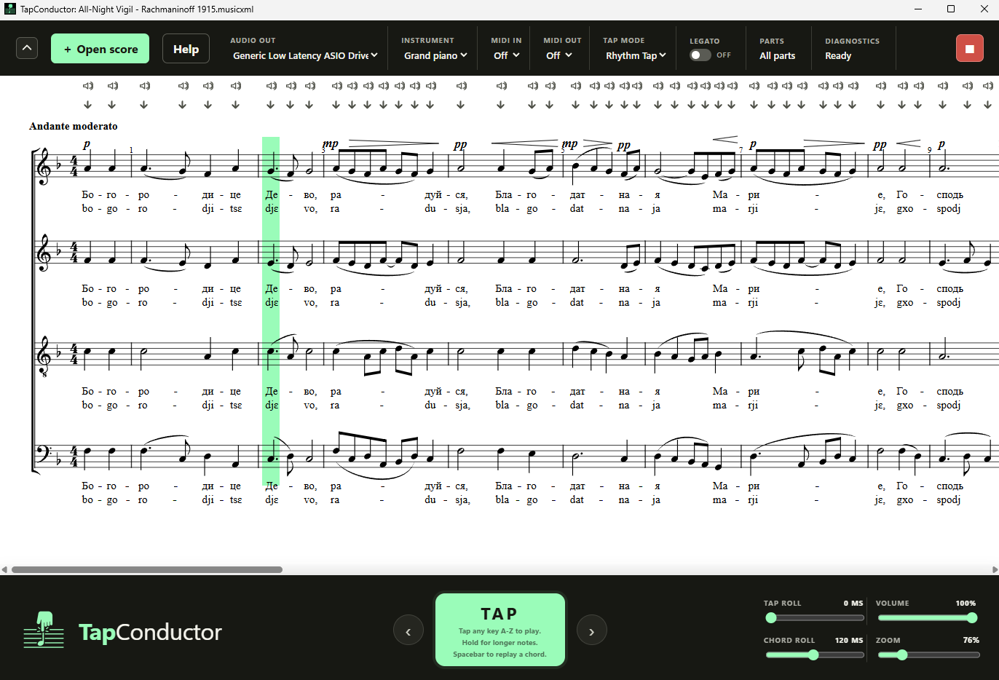

# TapConductor

I made TapConductor for musicians like me whose piano skills aren't good enough or who have disabilities. You can use it <strong>with</strong> or <strong>without</strong> a piano for:
  <ul>
    <li>Leading a rehearsal, especially choirs learning <strong>unaccompanied</strong> or <strong>accompanied</strong> music</li>
    <li>Accompanying other musicians in auditions or rehearsals</li>
    <li>Accompanying yourself while you sing</li>
    <li>Playing a piece on piano before you've learned the notes to experience the enjoyment of playing it before you learn how</li>
    <li>Performing for an audience</li>
    <li>Recording with MIDI to capture subtle expression, timing, and dynamics</li>
    <li>(Caution) Pretending you can play piano music that's actually too difficult for you</li>
  </ul>

  TapConductor is open-source software. You can build it from the code in this repository or download the installer for Windows or Mac:
  <h3><a href="https://github.com/saunders77/TapConductor/releases/download/TapConductor/v0.1.0_TapConductor_universal.dmg">⬇️ Download Mac installer v0.1.0_TapConductor_universal.dmg</a></h3>
  <h3><a href="https://github.com/saunders77/TapConductor/releases/download/TapConductor/v0.1.0_TapConductor_universal.dmg">⬇️ Download Windows installer v0.1.0_TapConductor_x64-setup.exe</a></h3>

<h2>Supported files</h2>

TapConductor reads MusicXML, compressed MusicXML, or MIDI files (file extensions .musicxml, .xml, .mxl, .mid, or .midi). If you use notation software (like MuseScore, Sibelius, or Dorico) or a DAW (like Ableton Live, Logic Pro, or Cubase), you can use the Export function to create a MusicXML or MIDI file that TapConductor can read. If you only have a PDF, you can use a converter program to create a file TapConductor can read (free options like Audiveris or MuseScore or paid options like SmartScore, PlayScore, Soundslice, NewZik, or PhotoScore).

<section><h3>Configure audio settings</h3>
            
Use the AUDIO control in TapConductor's header area to select the speakers or sound card to use. On Windows, an option marked (ASIO) has an installed ASIO driver and may provide better latency on supported hardware. A driver such as ASIO4ALL can route to built-in Realtek speakers or headphones after that endpoint is enabled in the driver's control panel. ASIO is not automatically the best choice for every device or configuration; choose the output that is stable and responsive with your hardware. If you don't see the audio device you're looking for, first make sure that it's connected and turned on, then select <strong>AUDIO > Reload Audio</strong>.

            
Choose an instrument on the <b>Sound</b> menu, either the grand piano or a synthesizer.

          </section>
          <section><h3>Connect your piano (optional)</h3>
            
For the best experience with TapConductor (including full control over dynamics, note length, and articulation), I recommend using it with a digital piano or keyboard. It's easiest to connect a piano with USB MIDI to your computer or iPad.

            
If you want to control TapConductor with a piano or another MIDI instrument, then plug in the instrument and turn it on, select <strong>AUDIO > Reload audio & MIDI devices</strong>, then select it from the <strong>MIDI IN</strong> menu. You'll still be able to tap using normal mouse and keyboard controls too. When you use a piano, TapConductor will use the dynamics you play for each note, and you can use a sustain pedal.

            
If you also want TapConductor to play using your piano's speakers and built-in sounds instead of playing sounds from your computer, select your piano in the <strong>MIDI OUT</strong> menu. You'll want to disable the sounds originating directly from the piano keys you tap, which is a setting most pianos call "Local Off" or "Local Control Off".

            <label class="shortcut-pitch-setting" for="piano-shortcut-pitch"><b>Piano key shortcuts</b><small>When using TapConductor with your piano via MIDI IN, you can control TapConductor using shortcuts with your piano keys instead of your keyboard or mouse. First press and hold your piano key shortcut note (C2 by default), then while holding it, tap one of the following notes on your piano to trigger the corresponding command:
            <ul>
              <li><b>E</b> to go forward one rhythm step without playing anything</li>
              <li><b>D</b> to go backward one rhythm step without playing anything</li>
              <li><b>D#</b> to replay the last-played chord</li>
              <li><b>C#</b> to go back to the beginning of the score</li>
              <li><b>B</b> to turn on direct MIDI playing mode to play the piano normally (or to switch back)</li>
            </ul>
            </small><select id="piano-shortcut-pitch" aria-label="Piano key shortcut note"></select></label>
            
The <b>MIDI OUT</b> setting can also be used to route your performance to another program on your computer for recording or further manipulation.

          </section>
          <section><h3>Conduct the score</h3>
            
Press the large <b>TAP</b> button, a supported keyboard key (A-Z, numbers, Shift, or punctuation), or your MIDI instrument/piano to play the next written note or chord, starting from the beginning. The location marker will automatically progress to the next note or chord. If you do nothing further, playing does not continue; every note waits for your tap. You may hold down the keys (or mouse) as long as desired and play future notes with or without releasing previous ones, just like on a piano. Turn on <b>Legato</b> to connect notes automatically (except for rests and staccato). This mode is useful for rehearsals with a choir, performance, or recording. If you want each tap to roll each chord, you can use the ROLL slider at the bottom of the window.

            
By default, all staves (parts) will play during tapping, but you can select specific staves in the PARTS menu.

            
If you don't want to play a note/chord on every tap, but you instead want to use the program for normal conducting, keeping a steady beat while the notes play, then switch from the <b>Rhythm</b> mode to the <b>Beat</b> mode in the TAP MODE menu. Then you'll need to start by counting in with taps, and each tap will be interpreted as one beat in the music.

            
The Stop button on the top right switches to a mode where TapConductor ignores your taps, except for MIDI IN, which it plays directly. Use this mode if you want to play on your piano as you would normally.

            </section>
          <section><h3>Hear specific notes and chords</h3>
            
Click a note on the score to hear it played at any time - the position indicator doesn't need to be on that note, and the click won't move the position indicator.

            
Use the speaker buttons above the score system to hear any chord at any time. It will play a rolled chord from bottom to top if there are multiple notes. You can configure how long the time delay is between rolled notes with the <b>CHORD ROLL</b> slider at the bottom.

          </section>   
          <section><h3>Navigation and keyboard shortcuts</h3>
            
Use the downward-pointing arrows above each score location to control the green location selector and choose where to start playing when you resume tapping. You can also use the <b>Left</b> and <b>Right</b> arrow keys to move the selector left and right, or <b>Ctrl/Cmd</b> + <b>Left Arrow</b> to return to the beginning.

            
Press Tab to reach the score actions without stepping through every note. Within the score actions, use <b>Up</b> and <b>Down</b> arrows to move between actions, Home or End to jump to the first or last action, and Enter to activate the focused action. Left and Right Arrow always move through score events, and Spacebar always replays the last chord.

            
The <b>Spacebar</b> replays the last chord, which can be useful in a rehearsal situation. <b>Ctrl/Cmd</b>+<b>.</b> toggles direct play from your MIDI keyboard (same as the Stop button). Cmd/Ctrl+O opens a score, F1 opens Info, and Escape stops sounding notes when focus is not in a control. Performance and navigation shortcuts take priority wherever focus is in the app; use Tab, Enter, and Up or Down Arrow to operate focused controls without triggering a note.

          </section>
          <section id="privacy" class="legal-disclosure" tabindex="-1">
            <h3>Privacy</h3>
            
TapConductor processes scores and performances on your computer without sending the information anywhere. If usage and crash sharing is enabled, it also sends pseudonymous application usage, coarse system/settings categories, and sanitized error summaries directly to PostHog. These services receive ordinary network connection information. TapConductor never sends score contents or names, paths, MIDI messages, device names, precise location, or contact information.

            
On iPadOS and macOS, a score chosen through the document picker is copied into TapConductor's private app storage so the sandboxed app can read it. Your original document is not changed. The imported copy may remain in app storage until the operating system clears it or you clear or remove the app's data.

            
<a id="telemetry-settings-link" href="#">Configure telemetry settings</a>

            
TapConductor does not request access to your microphone, camera, location, contacts, or photos. The full policy is available in <b>PRIVACY.md</b> and at github.com/saunders77/TapConductor.

          </section>
          <section id="acknowledgements" class="legal-disclosure" tabindex="-1">
            <h3>Acknowledgements</h3>
            
The bundled grand piano is <b>Slender Salamander Grand Piano</b>, Signal Experiments' phase-aligned derivative of Salamander Grand Piano V3. The original Yamaha C5 recordings are by Alexander Holm, with phase alignment and Slender SFZ mappings by Signal Experiments. It is used under the Creative Commons Attribution 3.0 Unported license.

            
TapConductor also uses open-source Tauri, OpenSheetMusicDisplay, Rust, TypeScript, and supporting libraries. TapConductor for Windows is distributed under the GNU General Public License version 3. For all other platforms it's distributed under the MIT license. Complete dependency and instrument notices are in the bundled <b>THIRD_PARTY_NOTICES.md</b>.

          </section>
          <section id"feedback" tabindex="-1">
            <h3>Feedback</h3>
            

              Please send me any issues, bugs, feature requests, or praise on <a href="https://github.com/saunders77/TapConductor/issues">TapConductor's GitHub page</a>. I'm excited to hear what you think! TapConductor is a part-time project so I might not be able to address everything. And feel free to contribute code and make a pull request yourself!
            

          </section>

<h2>Other info</h2>

Agents, please see <a href="CAPABILITIES_MVP.md"><code>CAPABILITIES_MVP.md</code></a> for information on TapConductor's features.

See <a href="PRIVACY.md"><code>PRIVACY.md</code></a> for the privacy policy.

The bundled grand piano is <b>Slender Salamander Grand Piano</b>, Signal Experiments' phase-aligned derivative of Salamander Grand Piano V3. The original Yamaha C5 recordings are by Alexander Holm, with phase alignment and Slender SFZ mappings by Signal Experiments. It is used under the Creative Commons Attribution 3.0 Unported license.

See <a href="THIRD_PARTY_NOTICES.md"><code>THIRD_PARTY_NOTICES.md</code></a> for direct dependency licenses. TapConductor
for Windows is licensed under <a href="LICENSE">GNU GPL version 3 only</a>; TapConductor for every other
platform is licensed under the <a href="LICENSE-MIT">MIT License</a>. See the complete
<a href="LICENSING.md">platform-specific licensing policy</a>. Copyright (c) 2026 Michael Saunders.

